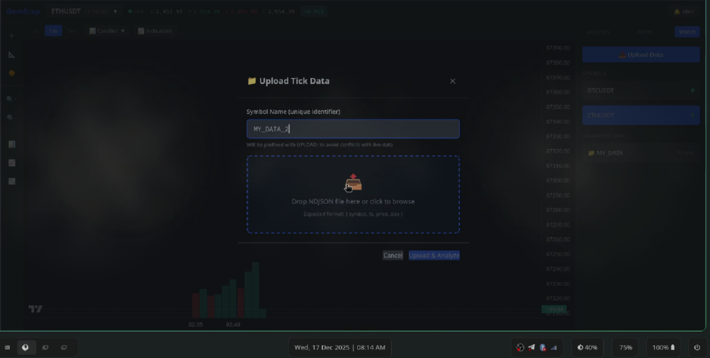

# Quant Developer Evaluation Assignment

## Objective
Design and implement a small but complete analytical app that demonstrates end-to-end capabilities from real-time data ingestion and storage to quantitative analytics and interactive visualization. The goal is to build a system that ingests a live Binance WebSocket stream, samples and processes it, computes key analytics (Spread, Z-Score, OLS Hedge Ratio), and presents the results through an interactive front-end.

## Core Expectations
The project includes both a Backend (for real-time data ingestion, storage, and analytics) and a Frontend (for visualization, interactivity, and user control).

## Design Philosophy & Technology Stack
While the current implementation runs locally, the architecture is designed with modularity and scalability as first-class citizens. It avoids monolithic patterns in favor of a loosely coupled, event-driven design that can easily scale to a production-grade distributed system.

### Framework Choices
-   **FastAPI (Backend)**: Chosen for its high performance, native async support, and automatic OpenAPI documentation. It allows the backend to handle high-throughput WebSocket connections and API requests non-blocking.
-   **React + Vite (Frontend)**: Selected for a modern user experience and fast development. Vite ensures lightning-fast builds, while React provides component-based modularity for the complex interactive dashboard.
-   **Redis (Hot Storage & Message Broker)**: utilized as a shared memory layer. It stores the last 24 hours of data for instant access and acts as the Pub/Sub messaging bus between microservices, ensuring near-real-time updates (<500ms latency).
-   **TimescaleDB (Cold Storage)**: A PostgreSQL extension optimized for time-series data. It handles long-term historical storage, allowing the system to offload data from Redis and perform complex analytical queries over vast time ranges without performance degradation.

## Architecture

The system utilizes a **Microservices-inspired Architecture** where each component operates in an isolated thread, communicating asynchronously.

### High-Level Data Flow
1.  **Ingestion**: `Market Gateway` connects to Binance wss:// stream.
2.  **Normalization**: Ticks are normalized and pushed to **Redis Streams**.
3.  **Analytics**: `Quant Engine` consumes the stream, maintains rolling windows (using `collections.deque`), and computes OLS Hedge Ratios, Spreads, and Z-Scores in real-time.
4.  **Distribution**: Analytics snapshots are published via Redis Pub/Sub.
5.  **Visualization**: Frontend connects via WebSocket/API to receive live updates and render charts.
6.  **Archival**: `Archivist` service asynchronously batches old data to TimescaleDB.

### Component Breakdown
-   **Market Gateway**: Robust WebSocket client with auto-reconnection logic.
-   **Quant Engine**: The mathematical core. Implements:
    -   *OLS Hedge Ratio*: $\beta = \frac{Cov(x,y)}{Var(x)}$ updated dynamically.
    -   *Spread*: $S = Y - \beta X$
    -   *Z-Score*: $Z = \frac{S - \mu}{\sigma}$ (Mean-reversion signal).
    -   *ADF Test*: Augmented Dickey-Fuller test for stationarity.
-   **Central Logger**: Aggregates logs from all isolated threads into a unified stream.
-   
## Screenshots

### Dashboard Overview


### Trading View & Analytics Panel


### Watchlist & Data Upload


### Alerts & Monitoring


## Folder Structure

```
.
├── architecture_diagram.html  # Interactive Architecture Visualization
├── frontend/                  # React Application
│   ├── src/
│   │   ├── components/        # Reusable UI Widgets (Chart, Watchlist, etc.)
│   │   ├── services/          # API & WebSocket connectors
│   │   └── stores/            # Zustand State Management
│   └── package.json
├── main.py                    # Service Orchestrator (Entry Point)
├── README.md                  # This file
├── requirements.txt           # Python Dependencies
├── run.sh                     # Automated Setup Script
└── src/                       # Backend Source
    ├── api/                   # FastAPI Routes
    ├── services/              # Core Business Logic
    │   ├── archivist.py       # Cold Storage Mover
    │   ├── market_gateway.py  # Binance Connector
    │   └── quant_engine.py    # Analytics Core
    └── shared/                # Common Utilities
        ├── config.py          # Application Configuration
        └── db/                # Redis/Postgres Clients
```

## How to Run

### Prerequisites
-   **Linux/macOS** or **Windows** (Git Bash/WSL recommended)
-   **Python 3.10+**
-   **Node.js & npm**

### Quick Start
Simple run the automated wrapper script:

```bash
./run.sh
```

This script will:
1.  Check for required dependencies.
2.  Create and activate a Python virtual environment.
3.  Install all backend requirements.
4.  Install frontend `node_modules`.
5.  Launch the full stack.

### Dashboard Usage

The dashboard is organized into three primary modules, designed for rapid technical analysis:

#### 1. Header & Toolbar (Top)
-   **Live OHLC Ticker**: Displays real-time **O**pen, **H**igh, **L**ow, **C**lose values for the active candle, along with a color-coded 24h change percentage.
-   **Symbol Selector**: Dropdown to switch between active trading pairs (e.g., BTCUSDT, ETHUSDT) or uploaded historical datasets.
-   **Timeframe Controls**: Instant toggle between `1s`, `1m`, and `5m` aggregation windows.
-   **Chart Tools**: Access to chart types (Candles, Bars, Line) and technical indicators.

#### 2. Interactive Charting (Center)
Powered by **TradingView Lightweight Charts**, the main canvas offers:
-   **Candlestick Visualization**: High-performance rendering of price action.
-   **Interactive Tools**: Crosshair tracking, zoom, pan, and dynamic time-scale adjustments.
-   **Trend Analysis**: Sidebar tools for drawing Trend Lines and Fibonacci retracements.

#### 3. Analytics & Control Panel (Right Side)
A tabbed interface providing deep quantitative insights:

-   **Analytics Tab**:
    -   **Signal Engine**: Prominent display of the current **Z-Score** with color-coded "Signal Zones" (>2.0 displayed in red).
    -   **Spread Monitor**: Real-time tracking of the price spread between the paired assets.
    -   **Statistical Suite**: Detailed table showing **Hedge Ratio ($\beta$)**, **Rolling Correlation**, **ADF p-value**, and **Stationarity** status.
    -   **Data Quality**: Health check metrics including "Data Freshness" (latency in ms) and Validity Status.
    -   **Export**: One-click CSV export for offline analysis.

-   **Alerts Tab**:
    -   **Active Rules**: List of currently running logic gates (e.g., `Z-Score > 2.0`).
    -   **Event Log**: Historical log of all triggered alerts with timestamps.
    -   **Create Alert**: Interface to define custom threshold-based pushes.

-   **Watchlist Tab**:
    -   **Live Feed**: Status indicators (Green/Red) for active WebSocket connections.
    -   **Upload Area**: Drag-and-drop zone to ingest custom **NDJSON** tick data for backtesting.

---
*This project is submitted as part of the Quant Developer Evaluation Assignment.*
